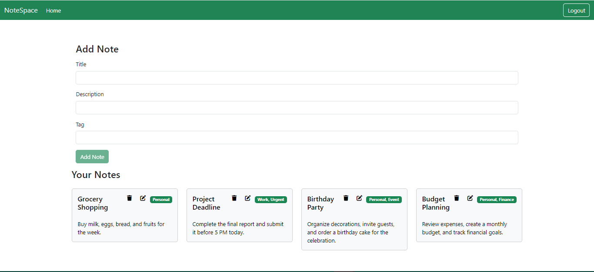
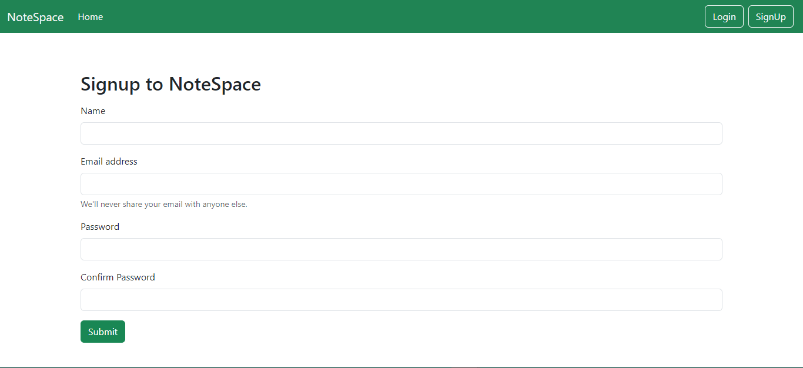

# NoteSpace

NoteSpace (A MERN Stack Project) : Your secure and private online space for personalized note-taking, accessible anytime, anywhere.

## Built With:

- MongoDB
- ExpressJs
- ReactJS
- NodeJS

## Screenshots

<h3>Home:</h3>
  
<h3>Signup:</h3>
    
<h3>Login:</h3>
  

### `npm run both`

Runs the app in the development mode.\
Open [http://localhost:3000](http://localhost:3000) to view it in your browser.

The page will reload when you make changes.\
You may also see any lint errors in the console.